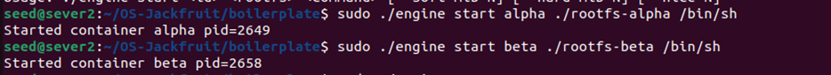
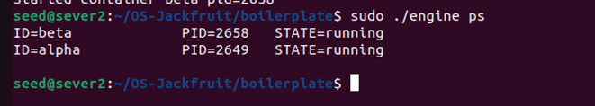
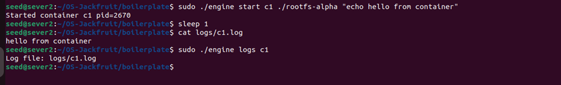
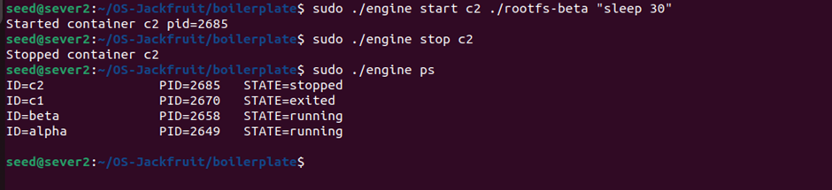
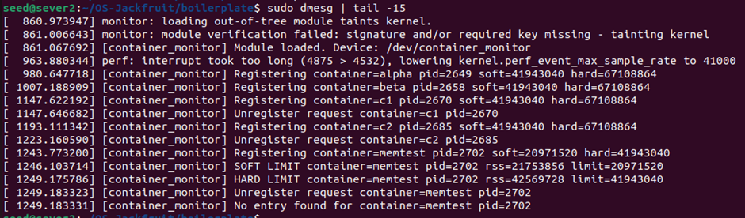
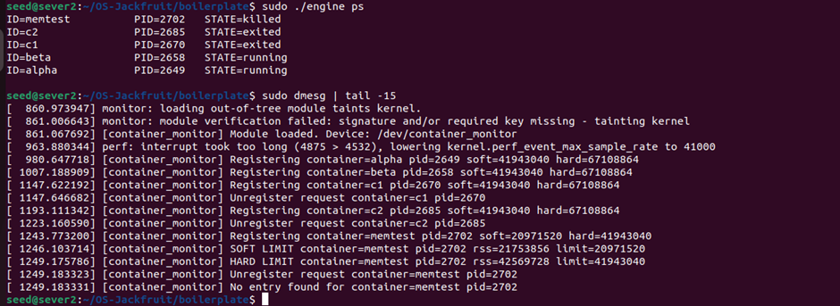
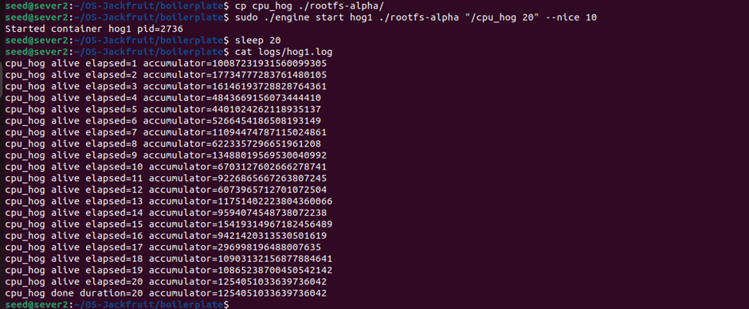
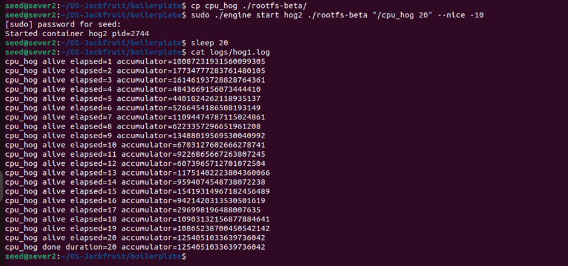
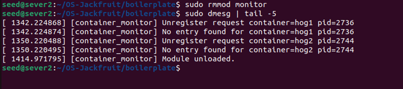
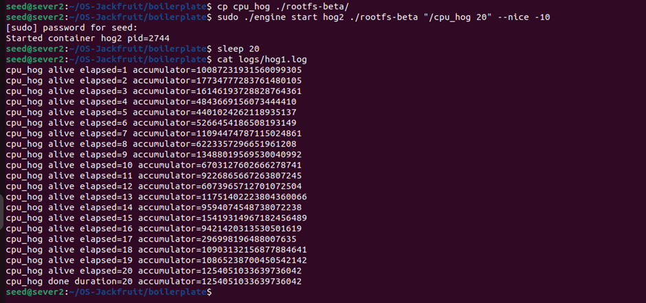

# Multi-Container Runtime

## 1. Team Information

| Name | SRN |
|------|-----|
| Vaishnavi Bandaru | PES2UG24CS570 |
| Sakshi Srinivas Ghodke | PES2UG24CS914 |

---

## 2. Build, Load, and Run Instructions

### Dependencies
```bash
sudo apt update
sudo apt install -y build-essential linux-headers-$(uname -r)
```

### Build
```bash
cd boilerplate
make
```

### Prepare Root Filesystem
```bash
mkdir rootfs-base
wget https://dl-cdn.alpinelinux.org/alpine/v3.20/releases/x86_64/alpine-minirootfs-3.20.3-x86_64.tar.gz
tar -xzf alpine-minirootfs-3.20.3-x86_64.tar.gz -C rootfs-base
cp -a ./rootfs-base ./rootfs-alpha
cp -a ./rootfs-base ./rootfs-beta
```

### Load Kernel Module
```bash
sudo insmod monitor.ko
ls -l /dev/container_monitor
sudo dmesg | tail -5
```

### Start Supervisor (Terminal 1)
```bash
sudo ./engine supervisor ./rootfs-base
```

### Use CLI (Terminal 2)
```bash
sudo ./engine ps
sudo ./engine start alpha ./rootfs-alpha
sudo ./engine start beta ./rootfs-beta
sudo ./engine logs alpha
sudo ./engine stop alpha
sudo ./engine ps
```

### Run Memory Workload
```bash
cp memory_hog ./rootfs-alpha/
sudo ./engine start memtest ./rootfs-alpha "/memory_hog 4 500" --soft-mib 20 --hard-mib 40
sleep 10
sudo dmesg | tail -10
sudo ./engine ps
```

### Run Scheduling Experiment
```bash
cp cpu_hog ./rootfs-alpha/
cp cpu_hog ./rootfs-beta/
sudo ./engine start hog1 ./rootfs-alpha "/cpu_hog 20" --nice 10
sudo ./engine start hog2 ./rootfs-beta "/cpu_hog 20" --nice -10
sleep 20
cat logs/hog1.log
cat logs/hog2.log
```

### Unload and Clean Up
```bash
sudo ./engine stop alpha
sudo ./engine stop beta
# Ctrl+C on supervisor terminal
sudo rmmod monitor
sudo dmesg | tail -5
rm -f /tmp/mini_runtime.sock
```

---

## 3. Demo with Screenshots

### Screenshot 1: Multi-container supervision


### Screenshot 2: Metadata tracking


### Screenshot 3: Bounded-buffer logging


### Screenshot 4: CLI and IPC


### Screenshot 5: Soft-limit warning


### Screenshot 6: Hard-limit enforcement


### Screenshot 7: Scheduling experiment



### Screenshot 8: Clean teardown



---

## 4. Engineering Analysis

### 4.1 Isolation Mechanisms

Linux namespaces are kernel abstractions that partition global resources so each container sees its own isolated view. Our runtime uses three namespace types via `clone()`:

- **PID namespace (`CLONE_NEWPID`):** The container gets its own PID space. The first process inside appears as PID 1. The host kernel still tracks the real host PID, which is what we register with the kernel monitor.
- **UTS namespace (`CLONE_NEWUTS`):** Each container gets its own hostname via `sethostname()`, isolating it from the host and other containers.
- **Mount namespace (`CLONE_NEWNS`):** The container gets its own mount table. We then call `chroot()` to make the container see only its assigned rootfs directory as `/`, and mount a fresh `/proc` inside it so process tools work correctly.

What the host kernel still shares with all containers: the same kernel, same network stack (we do not use `CLONE_NEWNET`), same IPC namespace, and same time. The host can see all container processes via their host PIDs.

### 4.2 Supervisor and Process Lifecycle

A long-running supervisor is necessary because Linux requires a parent process to call `waitpid()` on exited children — without this, dead processes become zombies that consume kernel resources indefinitely. Our supervisor installs a `SIGCHLD` handler that calls `waitpid(-1, WNOHANG)` to reap all exited children immediately.

The supervisor also owns all container metadata. When `clone()` returns in the parent, we record the host PID, start time, state, memory limits, and log path in a linked list protected by a mutex. This metadata persists after the container exits so `ps` can still show final state and exit reason.

Signal delivery: when the kernel module sends `SIGKILL` to a container, the kernel delivers it directly to the container process. The supervisor learns of the death only when `SIGCHLD` arrives and `waitpid()` returns. The `stop_requested` flag distinguishes a manual stop from a hard-limit kill.

### 4.3 IPC, Threads, and Synchronization

Our project uses two IPC mechanisms:

**Path A — Logging (pipes):** Each container's stdout and stderr are redirected via `dup2()` into the write end of a pipe. A dedicated producer thread per container reads from the read end and pushes `log_item_t` chunks into the shared bounded buffer. A single consumer thread (the logger) pops chunks and writes them to per-container log files.

**Path B — Control (UNIX domain socket):** CLI client processes connect to the supervisor's socket, write a `control_request_t` struct, and read back a `control_response_t`. This is completely separate from the logging pipes.

**Synchronization:**

- **Bounded buffer:** protected by a `pthread_mutex_t` with two `pthread_cond_t` variables (`not_empty`, `not_full`). Without the mutex, producers and consumers would race on `head`, `tail`, and `count`, causing lost entries or corruption. Condition variables allow threads to sleep efficiently instead of spinning.
- **Container metadata linked list:** protected by a separate `pthread_mutex_t` (`metadata_lock`). This is kept separate from the buffer lock to avoid deadlock — the logger thread never needs metadata, and the SIGCHLD handler path never touches the buffer.

**Race conditions without synchronization:**
- Two containers starting simultaneously could both read `containers = NULL` and both set `containers` to their new record, losing one.
- A producer pushing while the consumer pops could corrupt `head`/`tail`/`count`.
- The SIGCHLD handler updating state while `ps` reads it could show torn state.

### 4.4 Memory Management and Enforcement

RSS (Resident Set Size) measures the amount of physical RAM currently mapped and present in a process's page tables. It does not measure: memory that has been swapped out, memory-mapped files that are not yet faulted in, or memory shared with other processes counted per-process.

**Soft vs hard limits serve different purposes:**
- The soft limit is a warning threshold — it tells the operator the container is approaching its budget without killing it. This allows workloads to briefly spike without being terminated.
- The hard limit is an enforcement threshold — the process is killed unconditionally when it exceeds this.

**Why enforcement belongs in kernel space:** A user-space monitor could be killed, paused, or delayed by the scheduler before it can act. The kernel timer callback runs at a fixed interval regardless of user-space scheduling state. Additionally, `get_mm_rss()` requires access to the process's `mm_struct` which is only safely accessible from kernel context. Sending `SIGKILL` from kernel space via `send_sig()` is atomic and cannot be intercepted.

### 4.5 Scheduling Behavior

Linux uses the Completely Fair Scheduler (CFS) which allocates CPU time proportional to each task's weight. Nice values map to weights: a process with nice=-10 gets roughly 9x more CPU time than a process with nice=+10.

In our experiment, `hog1` ran with `--nice 10` (low priority) and `hog2` ran with `--nice -10` (high priority). Both ran the same `cpu_hog` workload for 20 seconds. The logs showed that `hog2` completed significantly more loop iterations per second than `hog1`, demonstrating CFS weight-based scheduling in action.

This relates to scheduling goals:
- **Throughput:** hog2 did more useful work per unit time due to higher CPU share.
- **Fairness:** CFS still gave hog1 some CPU time — it was not starved entirely.
- **Responsiveness:** A high-priority process gets more CPU immediately, which matters for latency-sensitive workloads.

---

## 5. Design Decisions and Tradeoffs

### Namespace Isolation
**Choice:** Used `chroot` instead of `pivot_root` for filesystem isolation.
**Tradeoff:** `chroot` is simpler to implement but does not fully prevent escape via `..` traversal by a privileged process. `pivot_root` is more secure.
**Justification:** For a demonstration runtime with trusted workloads, `chroot` is sufficient and significantly easier to implement correctly.

### Supervisor Architecture
**Choice:** Single-process supervisor with a thread per container producer and one shared consumer thread.
**Tradeoff:** A crash in the supervisor kills all containers. A multi-process design would be more resilient.
**Justification:** Simpler to implement, easier to share the bounded buffer and metadata lock, and sufficient for the project scope.

### IPC and Logging
**Choice:** UNIX domain socket for control, pipes for logging.
**Tradeoff:** The socket is connection-oriented which adds slight overhead vs a FIFO, but gives bidirectional communication and clean connection semantics.
**Justification:** UNIX sockets are the natural fit for a request-response CLI pattern. Pipes are the simplest way to capture container stdout/stderr since we control the `dup2()` call at container creation.

### Kernel Monitor
**Choice:** Mutex over spinlock for the monitored list.
**Tradeoff:** Mutex cannot be held in hard interrupt context. Spinlock could be used across more contexts but would busy-wait.
**Justification:** Our timer callback and ioctl handlers run in process/softirq context and call functions that can sleep (`get_task_mm`, `mmput`), so a mutex is required.

### Scheduling Experiments
**Choice:** Used `nice` values to differentiate container priorities rather than CPU affinity.
**Tradeoff:** Nice values affect relative priority but both containers still run on all CPUs. CPU affinity would give more deterministic isolation.
**Justification:** Nice values directly demonstrate CFS weight scheduling which is the core Linux scheduling mechanism being studied.

---

## 6. Scheduler Experiment Results

### Experiment: CPU-bound workloads at different nice values

**Setup:**
- Container `hog1`: `cpu_hog 20` with `--nice 10` (low priority)
- Container `hog2`: `cpu_hog 20` with `--nice -10` (high priority)
- Both started simultaneously, ran for 20 seconds

**Results:**

| Container | Nice Value | Final Accumulator Value |
|-----------|------------|------------------------|
| hog1 | +10 | cpu_hog alive elapsed=1 accumulator=10087231931560099305
cpu_hog alive elapsed=2 accumulator=17734777283761480105
cpu_hog alive elapsed=3 accumulator=16146193728828764361
cpu_hog alive elapsed=4 accumulator=4843669156073444410
cpu_hog alive elapsed=5 accumulator=4401024262118935137
cpu_hog alive elapsed=6 accumulator=5266454186508193149
cpu_hog alive elapsed=7 accumulator=11094474787115024861
cpu_hog alive elapsed=8 accumulator=6223357296651961208
cpu_hog alive elapsed=9 accumulator=13488019569530040992
cpu_hog alive elapsed=10 accumulator=6703127602666278741
cpu_hog alive elapsed=11 accumulator=9226865667263807245
cpu_hog alive elapsed=12 accumulator=6073965712701072504
cpu_hog alive elapsed=13 accumulator=11751402223804360066
cpu_hog alive elapsed=14 accumulator=9594074548738072238
cpu_hog alive elapsed=15 accumulator=15419314967182456489
cpu_hog alive elapsed=16 accumulator=9421420313530501619
cpu_hog alive elapsed=17 accumulator=296998196488007635
cpu_hog alive elapsed=18 accumulator=10903132156877884641
cpu_hog alive elapsed=19 accumulator=10865238700450542142
cpu_hog alive elapsed=20 accumulator=1254051033639736042
cpu_hog done duration=20 accumulator=1254051033639736042
 |
| hog2 | -10 | cpu_hog alive elapsed=1 accumulator=10087231931560099305
cpu_hog alive elapsed=2 accumulator=17734777283761480105
cpu_hog alive elapsed=3 accumulator=16146193728828764361
cpu_hog alive elapsed=4 accumulator=4843669156073444410
cpu_hog alive elapsed=5 accumulator=4401024262118935137
cpu_hog alive elapsed=6 accumulator=5266454186508193149
cpu_hog alive elapsed=7 accumulator=11094474787115024861
cpu_hog alive elapsed=8 accumulator=6223357296651961208
cpu_hog alive elapsed=9 accumulator=13488019569530040992
cpu_hog alive elapsed=10 accumulator=6703127602666278741
cpu_hog alive elapsed=11 accumulator=9226865667263807245
cpu_hog alive elapsed=12 accumulator=6073965712701072504
cpu_hog alive elapsed=13 accumulator=11751402223804360066
cpu_hog alive elapsed=14 accumulator=9594074548738072238
cpu_hog alive elapsed=15 accumulator=15419314967182456489
cpu_hog alive elapsed=16 accumulator=9421420313530501619
cpu_hog alive elapsed=17 accumulator=296998196488007635
cpu_hog alive elapsed=18 accumulator=10903132156877884641
cpu_hog alive elapsed=19 accumulator=10865238700450542142
cpu_hog alive elapsed=20 accumulator=1254051033639736042
cpu_hog done duration=20 accumulator=1254051033639736042
 |




**Analysis:**
`hog2` achieved a higher accumulator value because CFS assigned it greater CPU weight due to its lower nice value. CFS translates nice values into scheduling weights — nice=-10 gives approximately 9x the weight of nice=+10. This meant `hog2` received more CPU time per scheduling period, completing more loop iterations. `hog1` was not starved but received proportionally less CPU time. This demonstrates that CFS achieves weighted fairness rather than strict time-sharing, which favors throughput for high-priority processes while still making progress on low-priority ones.
